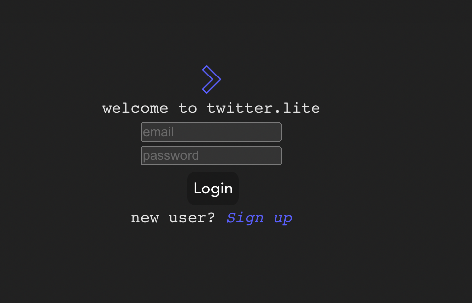
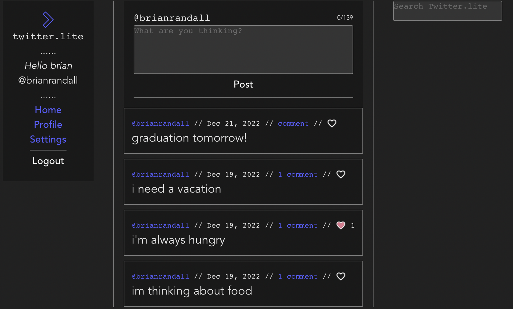

# _twitter.lite_ #
---
----

---
##### **_disclaimer: this was built as a project for school. i am in no way associated with twitter heavy_** #####

---


----
----

----
----

**_front end created with create-react-app_**


- install [node](https://nodejs.org/en/download/)
- navigate to ```/client```

```
npm i
```

```
npm run start
```

**_install sql_**

- click [here](https://dev.mysql.com/downloads/mysql/)

**_install sql workbench_**

- [here](https://dev.mysql.com/downloads/workbench/)
- connect to your local db instance
- create a new schema called ```fake_twitter```

**_install java se jdk_**

- [here](https://www.oracle.com/java/technologies/downloads/)

**_install / run java spring boot middleware_**

- install maven

```
brew install maven
```

- navigate to ```/server/twitter-lite```

```
mvn spring-boot:run
```
 
***

do things in this order. sql has to be up and running before you boot spring in order for db tables to be created properly

***

you may or may not have to go in and change the url(s) of the axios call(s) in order to get everything to talk to each other right. good luck!!!!!!!!!

***
